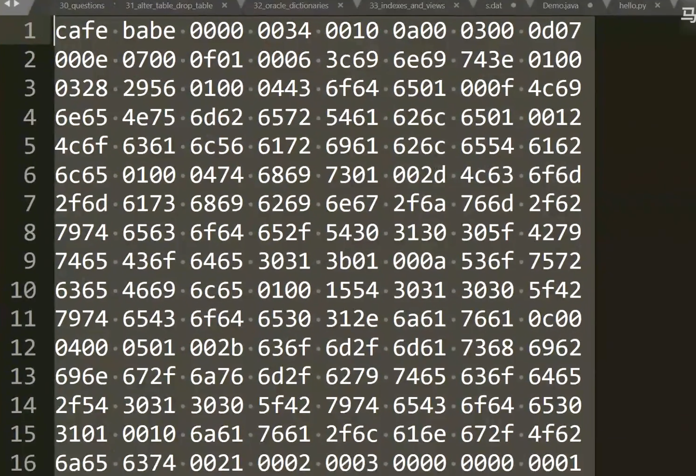
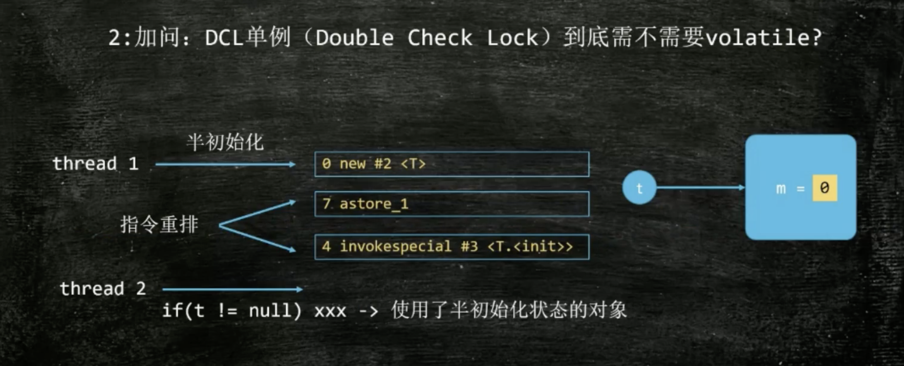

## JVM虚拟机讲义
### 1.

只要某种语言可以生成class文件，就可以交给jvm虚拟机解释执行


### 2.Class File Format
- Class文件16进制格式:

- 二进制字节流
- 数据类型：u1 u2 u4 u8和_info（表类型）
_info的来源是hotspot源码中的写法
- 查看16进制格式的ClassFile
sublime/notepad
IDEA插件-BinEd
- 观察ByteCode的方法：
  1.javap
  2.JBE：可以直接修改
  3.JClassLib IDEA插件之一
- Class文件形式：


### 3,ClassLoader

- verification判断class文件是否符合装入标准
- preparation是为class中的静态变量赋默认值，int为0，不是指定值
- 类加载器的层次图：

### 4.DCL为什么非要用volatile
Double Check Locking双重检查锁：
```
private volatile Singleton singleton;
public Singleton getInstance(){
 if(null==singleton){
  synchronized(Singleton.class){
   if(null==singleton){
     singleton=new Singleton();
   }
  }
 }
 return singleton;
}
```
因为volatile可以防止指令重排序,具体原因如下：


对象创建过程中的汇编new是和c语言中的malloc一样先给对象进行内存分配，m值此时为0，然后invokespecial调用构造方法进行变量初始化，这时m变为8，最后astore_i把这个对象的地址赋给t变量，在这个过程中如果没有volatile的禁止指令重排序的功能，很有可能，astore_i和invokespecial的指令执行顺序进行了调换，最后返回了一个未进行初始化的对象，这个可能性很小，但是大厂容易问，因此双重检查锁需要对变量volatile修饰

### 5.Java对象内存布局
查看工具，使用maven添加Java Object Layout

打印代码：
```
Stinrg c=ClassLayout.parseInstance(o).toPrintable();
```
分布:

数组：

普通对象中markword占8字节，class pointer指向这个类的字节码对象的地址，实例数据指向相应的数据，对齐是为了让所有的字节数可以被8整除
下面是Object对象的内存：


